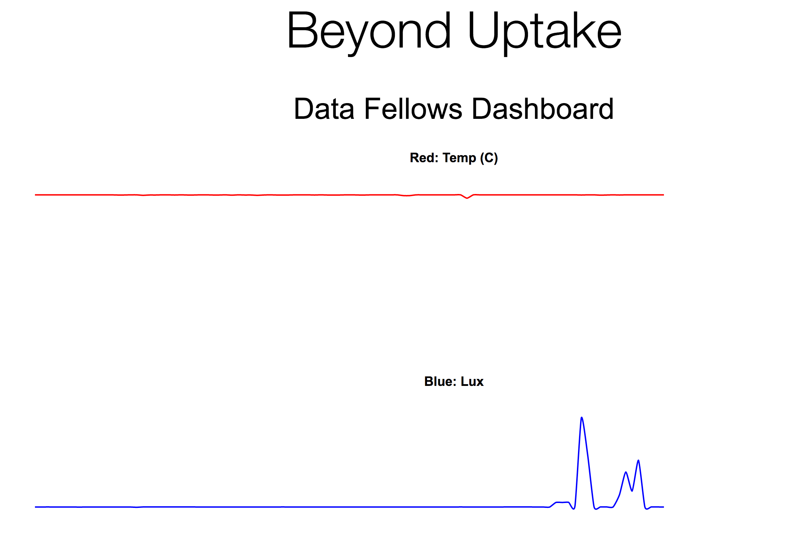

# IoT Sensors Class
Sensors Demo for Beyond Uptake Data Fellows

## Purpose 
This will be a rapid deep dive into IoT systems from collecting raw sensor data to displaying and interacting with the data in the cloud.

## Schematic 

## BOM
| Product         | QTY | Description               | Link                                                                                                                                                                         |
|-----------------|-----|---------------------------|------------------------------------------------------------------------------------------------------------------------------------------------------------------------------|
| Particle Photon | 1   | Wifi Microcontroller      | [https://store.particle.io/](https://store.particle.io/)                                                                                                                     |
| TMP36           | 1   | Analog Temperature Sensor | [https://www.adafruit.com/products/165](https://www.adafruit.com/products/165)                                                                                               |
| TSL2561         | 1   | Digital Light Sensor      | [https://www.adafruit.com/product/439](https://www.adafruit.com/product/439)                                                                                                 |
| Mini Breadboard | 1   | For quick prototyping     | [https://www.amazon.com/microtivity-170-point-Breadboard-Arduino-Jumper/dp/B004RXINEG](https://www.amazon.com/microtivity-170-point-Breadboard-Arduino-Jumper/dp/B004RXINEG) |
| 3D Printed Case | 1   | Custom Case               |                                                                                                                                                                              |
## Instructions
### IoT Device
1. Assemble your IoT device according to the schematic. Keep the device unplugged as you assemble.
2. Power up the Particle using the USB Micro cable.
3. The LED on the device should "breath" cyan.

### Programming the Photon
1. Clone this repo onto your computer. `git clone https://github.com/data-fellows-program/iot-class.git` if you don't have git you can download a zip file.
2. Login to https://build.particle.io using the credentials in your box.
3. Create a new project in the Particle IDE.
4. Copy the code in the particle directory `particle.ino` and paste it into your new project.
5. Add the library for the light sensor `ADAFRUIT_TSL2561_U` to the project.
6. Click the verify button to compile the code and check for errors.
7. Click the flash button to program the Photon over wifi. 

### The Data
1. https://console.particle.io/logs displays the events from your device.
2. If you do not like the interface you can get a raw stream to your terminal. 
`curl https://api.particle.io/v1/devices/events?access_token=[access token]`

### Displaying in a Dashboard
1. Edit the dashboard.html file in the dashboard directory to include your device id and access token.
2. Open up the dashboard.html file in your browser to verify if the data is displaying.

### Next Steps
Here you have a couple of options
1. Add more functionality to the dashboard. Add a legend, axis, statistical summary, make it pretty etc
2. Extend the Particle Code. Add more events, add logic on the device, blink the led.
3. Ask Danny if you want to add another sensor. 

### Libraries 
1. Rickshaw JS [http://code.shutterstock.com/rickshaw/](http://code.shutterstock.com/rickshaw/) used in the dashboard example. Built ontop of D3.js

2. Adafruit TSL2561 [https://github.com/wgbartley/adafruit_tsl2561](https://github.com/wgbartley/adafruit_tsl2561) library for the light sensor. 
